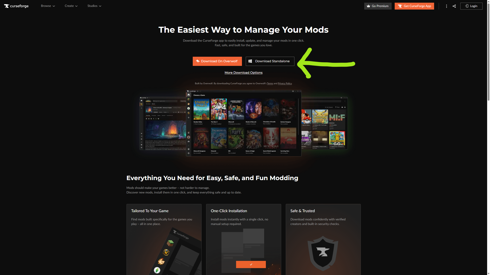
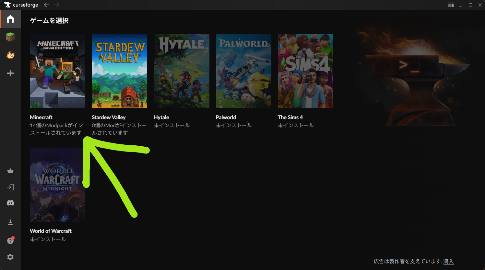
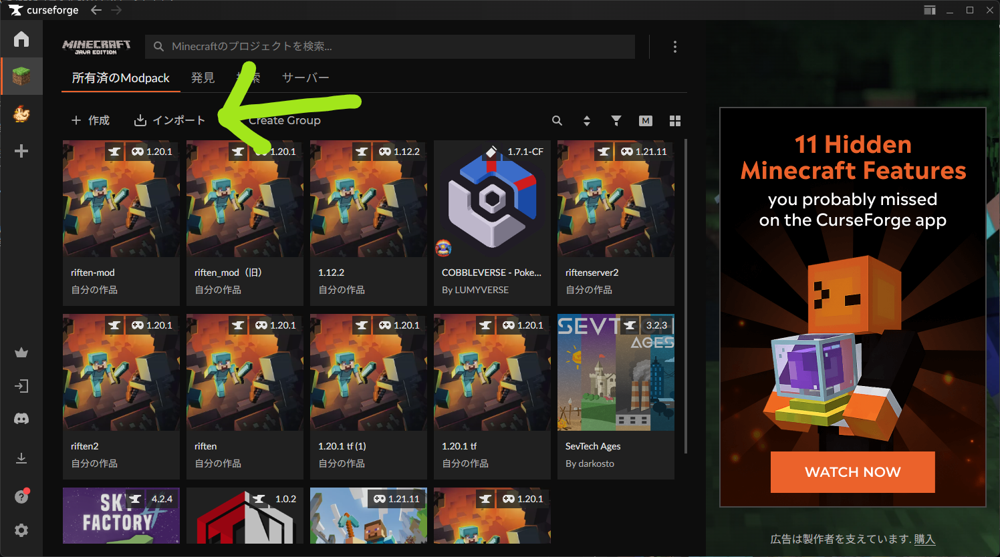
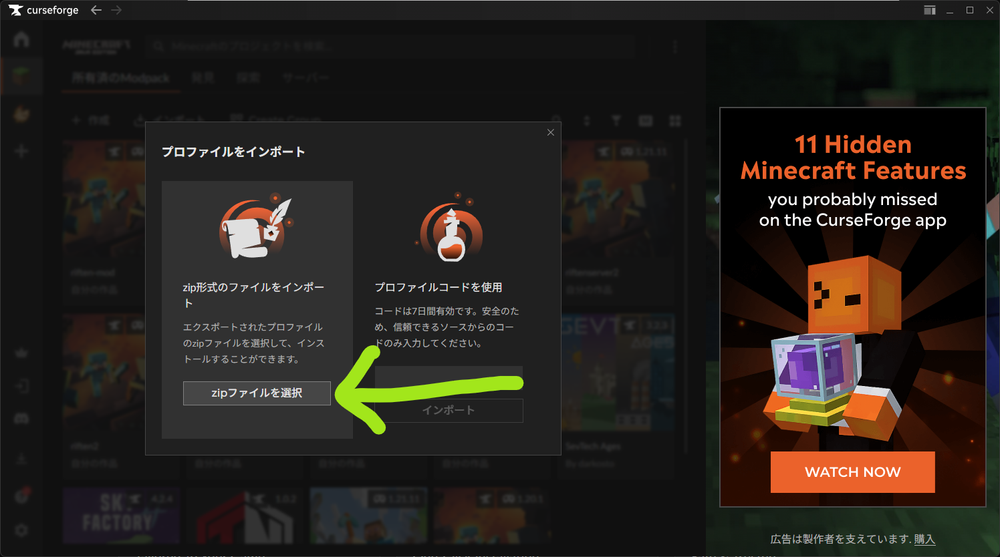
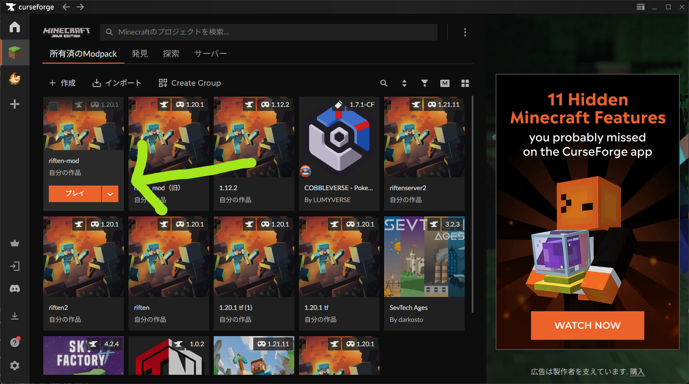
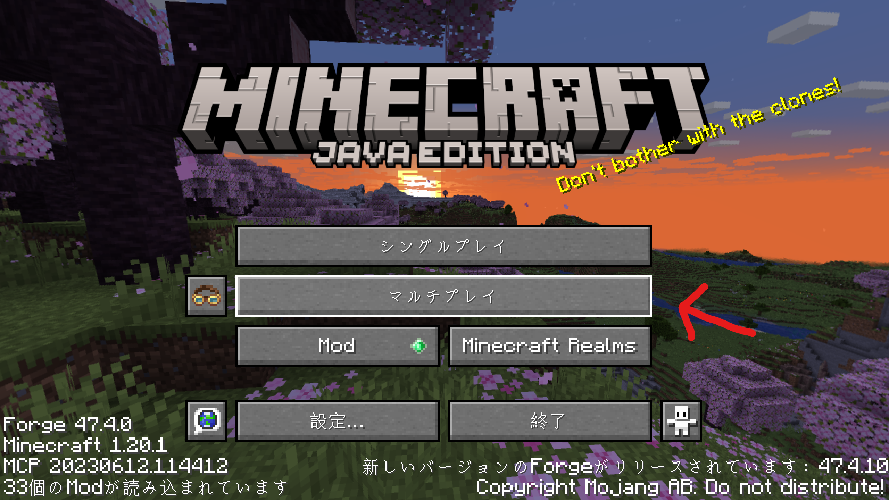
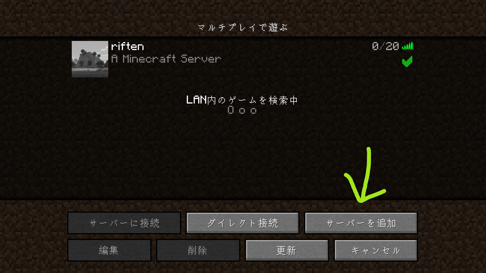
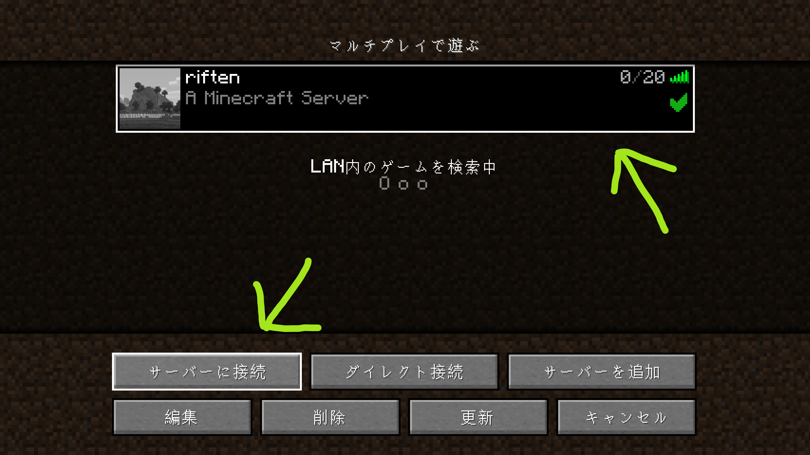

※ これは身内Discordサーバー用です

# マイクラ-modサーバーの入り方
## 下準備

1. CurseForgeをダウンロードする
    - ダウンロードリンク: https://www.curseforge.com/download/app
    - 右側の「Download Standalone」のほうがよさそう

2. modが入ったzipファイルをダウンロードしておく
    - [こちらですーーーーー](../../files/riften-mod.zip)

## やり方

1. CurseForgeを起動
2. 「Minecraft」を選択

3. 画面上部の「インポート」を選択

4. 「zip形式のファイルをインポート」を選択し、先ほどダウンロードしたzipファイルを選択

5. インポートしたModpackを選択し「プレイ」

## サーバーの接続方法（↑の続き）

0. ホワイトリストにマイクラのユーザー名を登録してもらう
1. minecraftのランチャーが開くはずなので，「プレイ」
1. タイトルから「マルチプレイ」を選択

2. 画面下部の「サーバーを追加」で、所定のipアドレスと任意の名前を入力してサーバーを追加（リソパは「毎回確認」でok）

3. 追加したサーバーを選択して「サーバーに接続」で入れる

