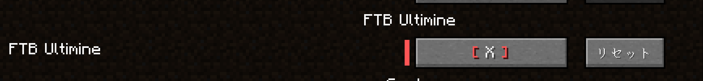
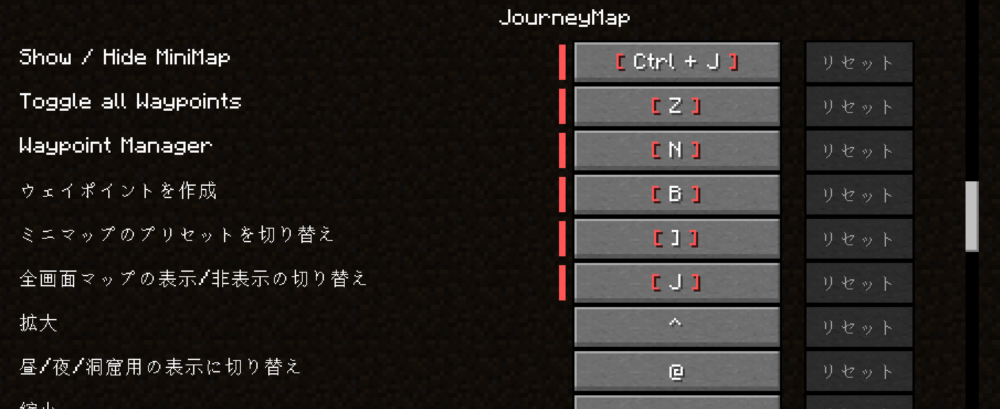
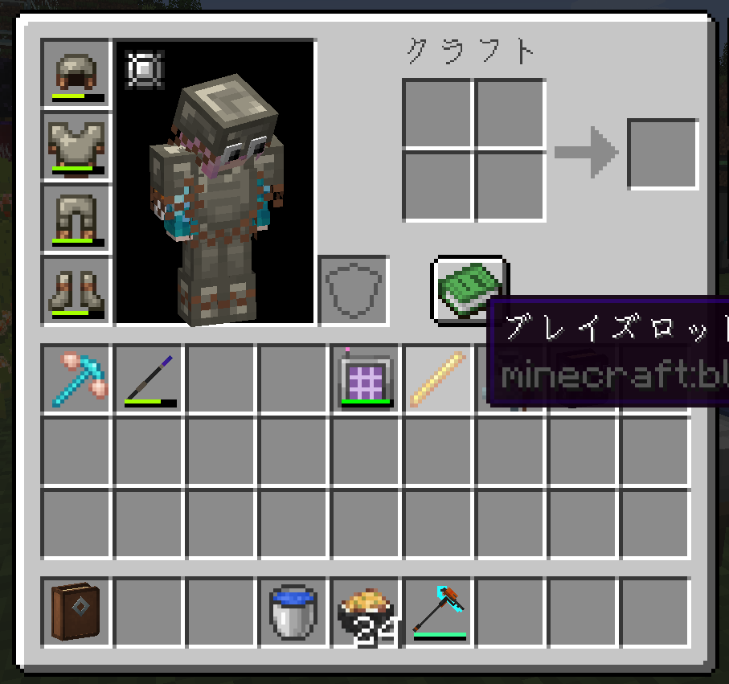
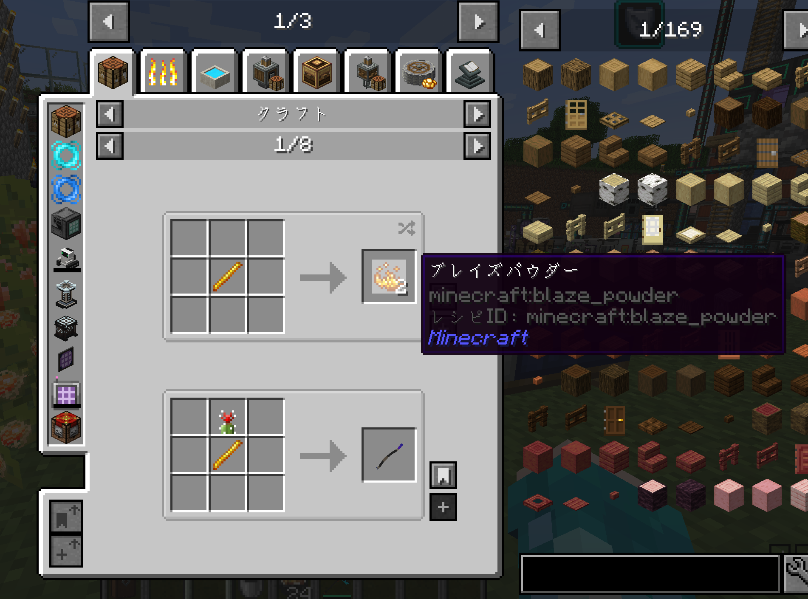
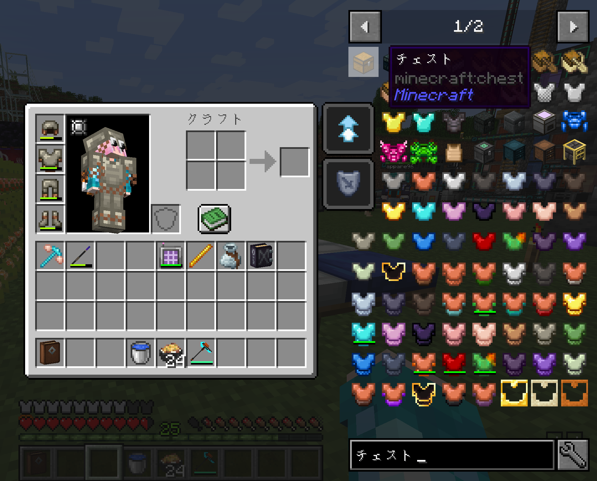
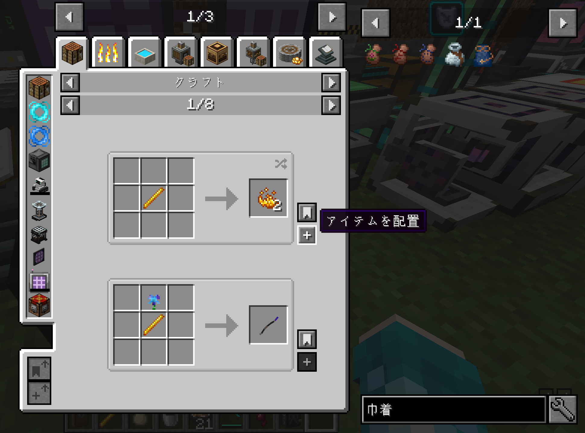
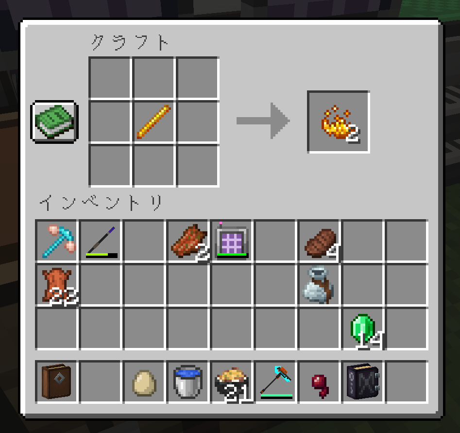

※ これは身内Discordサーバー用です

# riftenサーバーに入ってるmodについて
## やっておいたほうがいい設定
### FTB Ultimate
- いわゆる一括破壊mod
- ゲームメニュー → 設定 → 操作設定 → キー割り当て → FTB Ultimate　から任意のキーを割り当て
- 割り当てたキーを押しながらブロックを破壊することで一括破壊が可能

### トラベラーズバックパック
- あると便利なバックパックmod　デフォルトだとマップmodとキーが被っている
- ゲームメニュー → 設定 → 操作設定 → キー割り当て → JourneyMap → ウェイポイントを作成　を適当なキーに割り当て（もしくはEscで未割り当てに設定）
- バックパックを装備して「B」でバックパックを開ける

### JEI（Just Enough Items）
- とても便利なレシピmod　特に設定の変更はいらないです
- インベントリ等の中のアイテムにカーソルを合わせて「U」または「R」でレシピ検索に飛べる

- レシピ検索内のアイテムを左クリック/右クリックでさらに飛べる

- インベントリ右にある検索バーで任意のアイテムのレシピを検索することもできる

- 作業台等を開いてるとき，対象のレシピが作成可能なら「+」のボタンを押すことで配置・作成できる

## 入ってるmodについて
工事中です